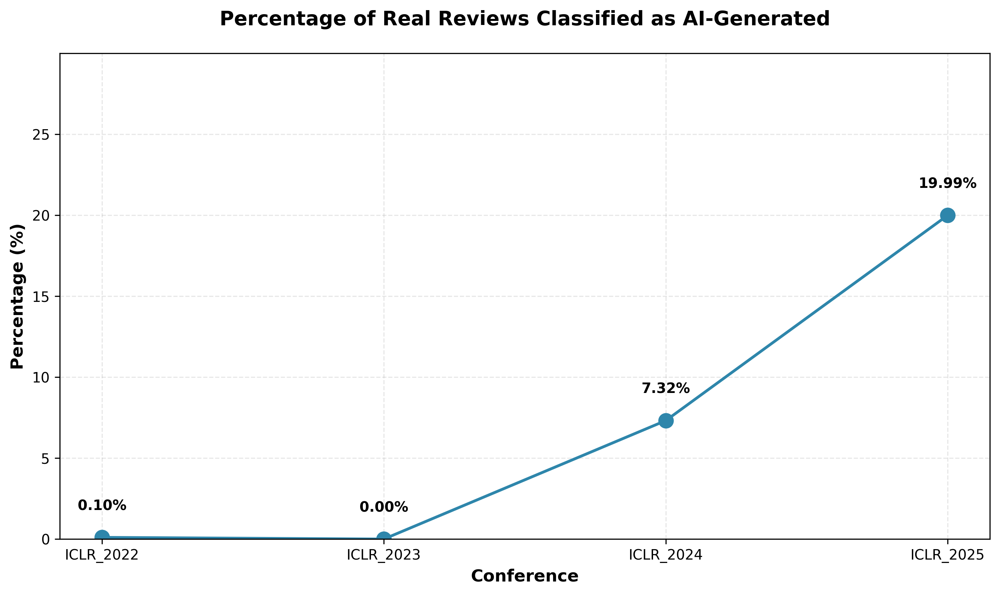
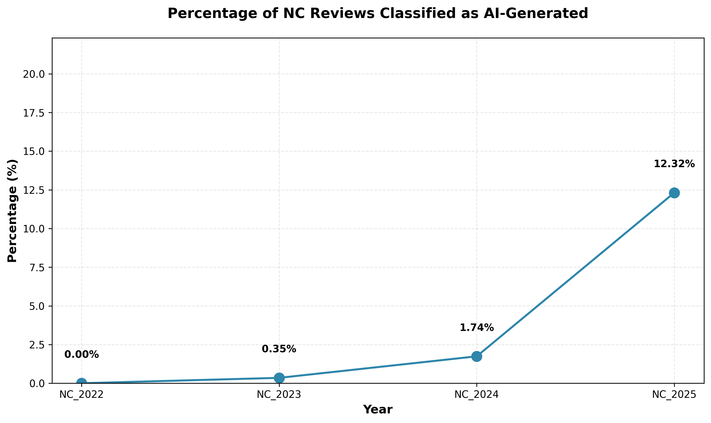
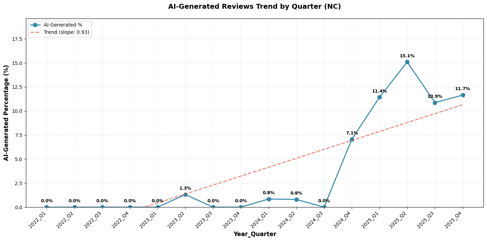

# AI Review Detection: Academic Paper Review Analysis

This project implements a complete pipeline for detecting AI-generated paper reviews using fine-tuned language models. The system downloads conference/journal data, generates synthetic reviews using AI models, trains a classifier to distinguish between real and AI-generated reviews, and performs inference on real data.

## Overview

This project addresses the growing concern of AI-generated academic reviews by:

1. **Collecting real reviews** from ICLR (International Conference on Learning Representations) and Nature Communications
2. **Generating synthetic reviews** using LLMs (GPT-4o, DeepSeek Reasoner)
3. **Training separate classifiers** using Longformer with LoRA fine-tuning to detect AI-generated content
   - **ICLR Model**: Trained on ICLR 2021 reviews, tested on ICLR 2022-2025
   - **Nature Communications Model**: Trained on NC 2021 reviews, tested on NC 2022-2025

## Pipeline Workflow

```
┌─────────────────────┐
│  1. Download Data   │  ← download_review.ipynb
│  (ICLR Papers +     │
│   Real Reviews)     │
└──────────┬──────────┘
           │
           ▼
┌─────────────────────┐
│  2. Generate AI     │  ← generate_review.ipynb
│     Reviews         │
│  (GPT-4o/DeepSeek)  │
└──────────┬──────────┘
           │
           ▼
┌─────────────────────┐
│  3. Fine-tune       │  ← finetune_lm.ipynb
│     Classifier      │
│  (Longformer+LoRA)  │
└──────────┬──────────┘
           │
           ▼
┌─────────────────────┐
│  4. Inference       │  ← inference.ipynb
│  (Classify Reviews) │
└─────────────────────┘
```

## ICLR Results

We trained a classifier for ICLR peer reviews. The model was trained on ICLR 2021 reviews and tested on reviews from 2022-2025.

### Model Performance on Training Set (ICLR 2021)

The fine-tuned Longformer+LoRA model achieves excellent performance on the 2021 training set:

**Confusion Matrix:**

|                    | Predicted Real | Predicted AI |
|--------------------|----------------|--------------|
| **Actual Real**    | 160            | 0            |
| **Actual AI**      | 0              | 160          |

**Classification Report:**

| Class              | Precision | Recall | F1-Score | Support |
|--------------------|-----------|--------|----------|---------|
| Real Review (0)    | 1.00      | 1.00   | 1.00     | 160     |
| AI Generated (1)   | 1.00      | 1.00   | 1.00     | 160     |
| **Accuracy**       |           |        | 1.00     | 320     |
| **Macro Avg**      | 1.00      | 1.00   | 1.00     | 320     |
| **Weighted Avg**   | 1.00      | 1.00   | 1.00     | 320     |

### AI Detection Trends (ICLR 2022-2025)



### Summary Statistics (ICLR)

| Year | Total Reviews | AI-Detected | Percentage |
|------|--------------|-------------|------------|
| 2022 | 1,937        | 2           | 0.10%      |
| 2023 | 1,887        | 0           | 0.00%      |
| 2024 | 1,818        | 133         | 7.32%      |
| 2025 | 1,961        | 392         | 19.99%     |

### Discussion (ICLR)

- Each year, we randomly sampled reviews from approximately 500 papers, resulting in around 2,000 review entries annually.
- In 2022 and 2023, the classifier detected virtually no AI-generated reviews. This is likely because ChatGPT and similar models were only released after the 2023 ICLR review process, so AI-generated content was not present in the earlier years; this further demonstrates the robustness and specificity of our model.
- Starting from ICLR 2024 and continuing into 2025, we observe a marked increase in the proportion of reviews classified as AI-generated, suggesting a rising trend in the potential usage of AI tools in review writing.

---

## Nature Communications Results

We trained a separate classifier specifically for Nature Communications (NC) peer reviews using the same methodology. The model was trained on NC 2021 reviews and tested on reviews from 2022-2025.

### Model Performance on Training Set (NC 2021)

The fine-tuned Longformer+LoRA model achieves excellent performance on the NC 2021 training set:

**Confusion Matrix:**

|                    | Predicted Real | Predicted AI |
|--------------------|----------------|--------------|
| **Actual Real**    | 120            | 0            |
| **Actual AI**      | 0              | 120          |


### AI Detection Trends by Year (NC 2022-2025)



### Summary Statistics (Nature Communications)

| Year | AI-Detected Percentage |
|------|------------------------|
| 2022 | 0.00%                  |
| 2023 | 0.35%                  |
| 2024 | 1.74%                  |
| 2025 | 12.32%                 |

### Quarterly Trend Analysis



### Discussion (Nature Communications)

- In 2022 and 2023, the classifier detected virtually no AI-generated reviews, consistent with the pre-ChatGPT era and validating our model's specificity.
- Starting from late 2024 and continuing into 2025, we observe a marked increase in the proportion of reviews classified as AI-generated.
- The quarterly trend analysis shows an upward trajectory with a positive slope (0.93 per quarter), confirming the rising trend.
- The pattern observed in Nature Communications mirrors that of ICLR, indicating this may be a broader trend across academic publishing.


